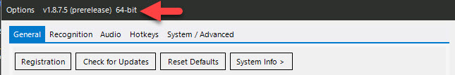
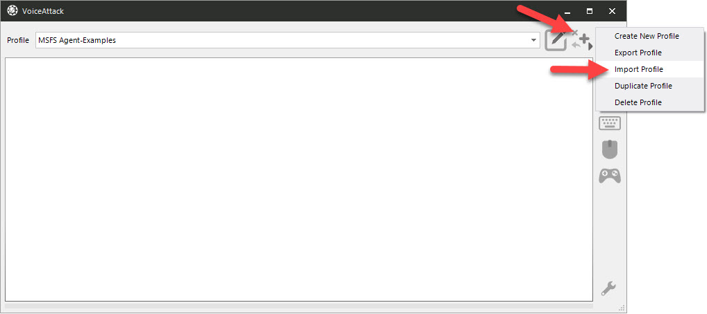
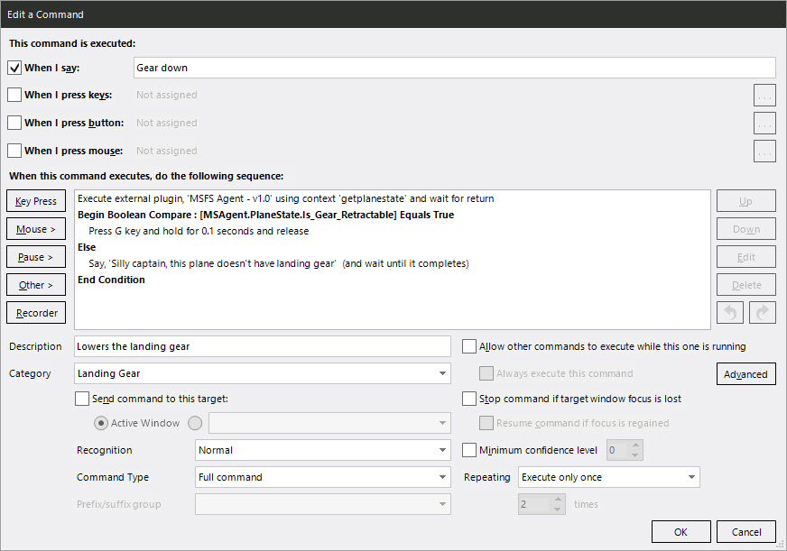
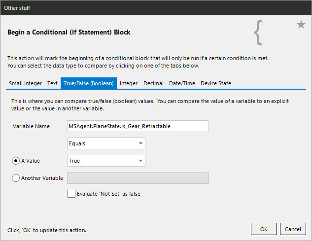
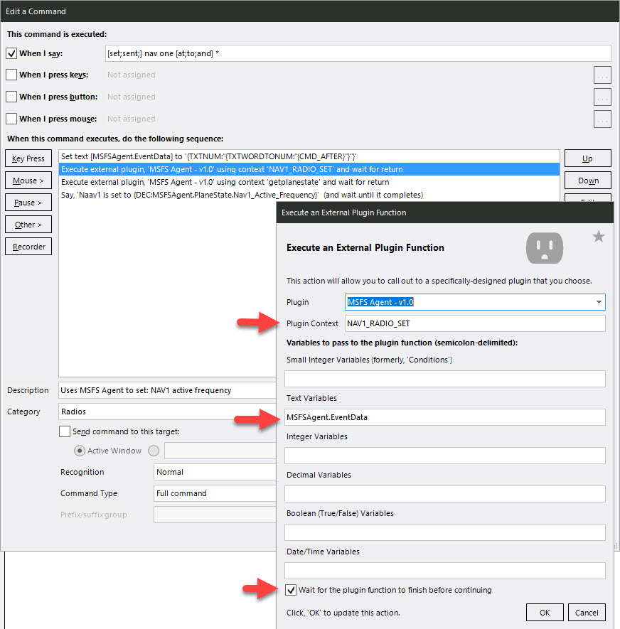
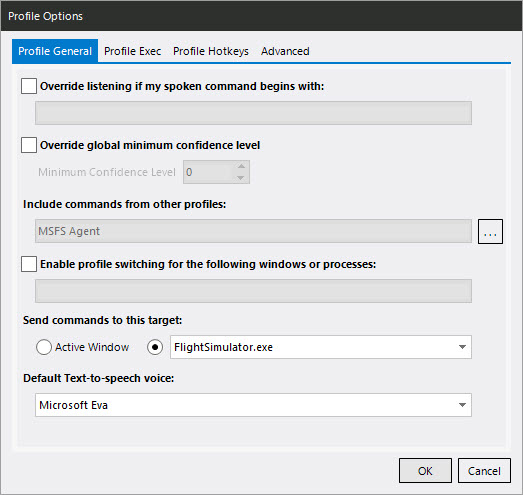
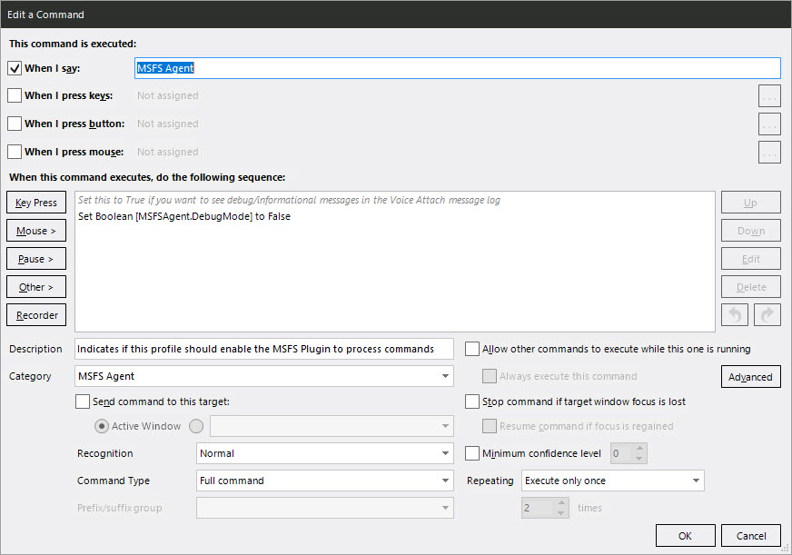
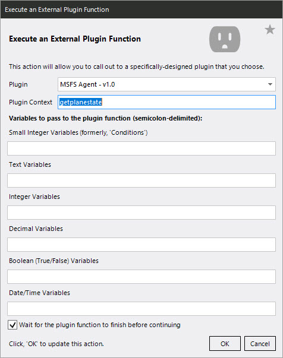
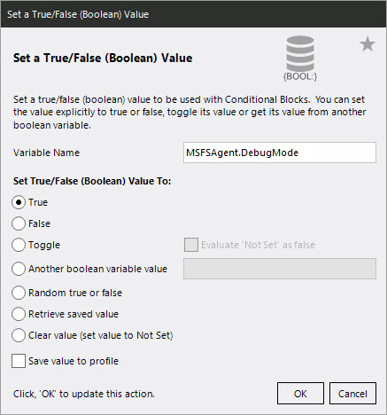

# Microsoft Flight Simulator 2020  plug-in for Voice Attack

Gives your [Voice Attack](https://voiceattack.com/) profiles the ability to trigger actions (i.e. set the radio frequency) in Microsoft Flight Simulator 2020 as well as get game state information back (i.e. status of landing gear). 

Using the variables, you can do conditional logic (i.e. if "Sim_On_Ground" don't allow landing gear up, etc.) or include additional information in spoken text (i.e. if "Local_Time" is > 5pm say "Good evening" else "Good Day").

***
If you enjoy the plug-in, feel free to [buy me coffee](https://www.paypal.com/donate?hosted_button_id=ZEJ4UZGGSM9Q8) :)

## Features

- Ability to set COM, NAV, and ADF Radios (active and and standby)
- Ability to set most Autopilot functions : Heading, Vertical Speed, Altitude, Air Speed, ...
- Ability to set the Transponder code
- Ability to toggle each of the different types of lights : Nav, Beacon, Strobes, Cabin, Taxi, Landing, ... 
- Extracts 50+ sim data points into Voice Attack variables (see [full list](#list-of-msfsagent-variables) below)

## Dependencies

- Microsoft Flight Simulator 2020 (any version)
- SimConnect (already included in the project, no install needed by you)
- Voice Attack **64-bit** (free or paid) - *required because SimConnect only comes in 64-bit* 

  
## Who is this for?
Microsoft Flight Simulator 2020 users who want to use Voice Attack commands to control things they can't already do with keyboard commands (i.e. set a radio frequency).  It's even more useful now that MSFS supports VR :)

## Inspiration and kudos
Other people and work that inspired and helped me accomplish this project:
- **Virtual Voyager** : [Immersive Aviation for MSFS 2020](https://www.youtube.com/watch?v=wQ5Ed-C_dbs) for overall co-pilot inspiration
- **MRacko** for  [MSFS Mobile Companion App](https://github.com/mracko/MSFS-Mobile-Companion-App) and exmples of calling radios
- **C-True** for examples of using [managed code for MSFS 2020 SimConnect](https://github.com/c-true/FsConnect)

## Getting setup

1. Ensure you have the 64-bit version of Voice Attack installed (check the window tile in the Options window)

2. Extract the zip file and copy the **MSFSAgent** folder to your Voice Attack "apps" folder (i.e. C:\Program Files\Voice Attack\apps\MSFSAgent\\)
      - **Important**: it must be in it's own folder in the apps directory (i.e. Voice Attack/apps/MSFSAgent/ not Voice Attack/apps/)
4. Esure "**Enable Plug-in Support**" is enabled in Voice Attack (go to Options (wrench icon) > General)
      
5. In the profiles where you want to use the agent, **add a Voice Attack command for "MSFS Agent"**.  If the agent doesn't see this command, it won't do anything.  This is to prevent the agent using cycles on profiles it's not needed on.
6. Restart Voice Attack  and you should be good to go!

#### Optional : Import the example profile
In the zip file there is an example Voice Attack profile (.vap file) with commands for setting radios and using the variables.  You can copy these commands into your existing profiles if you want or extend the example.

## Using MSFSAgent Variables

When the plug-in is called with the "GetPlaneState" Context, it will grab the latest data from the sim and put it into Voice Attack variables prefixed with "MSFSAgent.GetPlaneState".  See further down for the [full list of variables](#list-of-msfsagent-variables).

#### Example checking a variable's value
Let's say we want a command to lower the landing gear but we want to check if the plane even has landing gear first:  

- First, we'll execute a call to the plugin with the Context of "getplanestate" to get fresh data and ensure the Voice Attack variables we need for the next step are created.

- The variable we'll use in this case is "MSAgent.PlaneState.Is_Gear_Retractable".  Since it's a bool type, we'll add a conditional check to see if it's True.
- If it is True, we'll execute a keyboard command to lower them.   If it's not true, we'll inform the captain we don't have landing gear :)

### Calling Events and passing event data

To trigger an event, set the **Content** value to the event you want to trigger (it's not case-sensitive).  If the event needs data, it needs to be passed as a "text" variable with the name **MSFSAgent.EventData**.  The plugin will convert this value to the proper format needed for the event internally.  If the event doesn't need data, the variable doesn't need to be passed or set.

>Note: It's also a good idea to call **GETPLANESTATE** after an event to get updated sim data and to confirm the thing you were trying to change actually changed in the sim.

#### Example call for setting the Nav1 active frequency
Here I use a wildcard (*) in the Voice Attack command to get the frequency.  I set the MSFSAgent.EventData variable using {TXTNUM:"{TXTWORDTONUM:"{CMD_AFTER}"}"} which extracts the numbers from what was said for that portion of the command, then converts them into text which is what the variable expects.  So "Set Nav1 to 119.12 please" becomes "119.12".

## List of MSFSAgent Variables
These variables are created and updated in Voice Attack whenever you call the plugin with the GETPLANESTATE context.  It uses the same variable names that SimConnect exposes but adds a "MSFSAgent.PlaneState." prefix to avoid conflicts with other plug-ins.

> Note: more information on the variables can be found in the SimConnect or SDK documentation.  I also used this [reference from prepare3d](https://www.prepar3d.com/SDKv5/sdk/references/variables/simulation_variables.html) which gives a bit more info on the variables.

| Variable Name                                   | Type    | Example Value        | Comment |
|-------------------------------------------------|---------|----------------------|---------|
| MSAgent.PlaneState.Airspeed_Indicated           | int     | 0                    |         |
| MSAgent.PlaneState.Ambient_Temperature          | int     | 58                   |         |
| MSAgent.PlaneState.Apu_Generator_Switch         | int     | False                |         |
| MSAgent.PlaneState.Atc_Airline                  | string  | Air Canada           |         |
| MSAgent.PlaneState.Atc_Flight_Number            | string  | F1F3                 |         |
| MSAgent.PlaneState.Atc_Id                       | text    | LQD-ACA              |         |
| MSAgent.PlaneState.Autopilot_Airspeed_Hold      | bool    | False                |         |
| MSAgent.PlaneState.Autopilot_Airspeed_Hold_Var  | int     | 0                    |         |
| MSAgent.PlaneState.Autopilot_Altitude_Lock      | bool    | False                |         |
| MSAgent.PlaneState.Autopilot_Altitude_Lock_Var  | int     | 0                    |         |
| MSAgent.PlaneState.Autopilot_Approach_Hold      | bool    | False                |         |
| MSAgent.PlaneState.Autopilot_Attitude_Hold      | bool    | False                |         |
| MSAgent.PlaneState.Autopilot_Available          | bool    | True                 |         |
| MSAgent.PlaneState.Autopilot_Backcourse_Hold    | bool    | False                |         |
| MSAgent.PlaneState.Autopilot_Heading_Lock       | bool    | False                |         |
| MSAgent.PlaneState.Autopilot_Heading_Lock_Dir   | int     | 0                    |         |
| MSAgent.PlaneState.Autopilot_Master             | bool    | False                |         |
| MSAgent.PlaneState.Autopilot_Nav_Selected       | decimal | 1                    |         |
| MSAgent.PlaneState.Autopilot_Nav1_Lock          | bool    | False                |         |
| MSAgent.PlaneState.Autopilot_Vertical_Hold      | bool    | False                |         |
| MSAgent.PlaneState.Autopilot_Vertical_Hold_Var  | int     | 0                    |         |
| MSAgent.PlaneState.Autopilot_Yaw_Damper         | bool    | False                |         |
| MSAgent.PlaneState.Bleed_Air_Source_Control     | int     | 1                    |         |
| MSAgent.PlaneState.Brake_Parking_Indicator      | bool    | True                 |         |
| MSAgent.PlaneState.Com1_Active_Frequency        | decimal | 124.85               |         |
| MSAgent.PlaneState.Com1_Standby_Frequency       | decimal | 124.85               |         |
| MSAgent.PlaneState.Com2_Active_Frequency        | decimal | 124.85               |         |
| MSAgent.PlaneState.Com2_Standby_Frequency       | decimal | 124.85               |         |
| MSAgent.PlaneState.Electrical_Master_Battery    | bool    | False                |         |
| MSAgent.PlaneState.Engine_Type                  | int     | 5                    | Engine type: 0 = Piston, 1 = Jet, 2 = None, 3 = Unsupported , 4 = Unsupported, 5 = Turboprop        |
| MSAgent.PlaneState.Flaps_Handle_Index           | decimal | 0                    |         |
| MSAgent.PlaneState.Gear_Handle_Position         | int     | 1                    | -1 = Not available, 0 = Up, 1 = Down        |
| MSAgent.PlaneState.Ground_Velocity              | int     | 0                    |         |
| MSAgent.PlaneState.Heading_Indicator            | int     | 6                    |         |
| MSAgent.PlaneState.Hydraulic_Switch             | bool    | True                 |         |
| MSAgent.PlaneState.Is_Gear_Retractable          | bool    | True                 |         |
| MSAgent.PlaneState.Light_Beacon                 | bool    | False                |         |
| MSAgent.PlaneState.Light_Cabin                  | bool    | False                |         |
| MSAgent.PlaneState.Light_Landing                | bool    | False                |         |
| MSAgent.PlaneState.Light_Logo                   | bool    | False                |         |
| MSAgent.PlaneState.Light_Nav                    | bool    | False                |         |
| MSAgent.PlaneState.Light_Panel                  | bool    | False                |         |
| MSAgent.PlaneState.Light_Recognition            | bool    | True                 |         |
| MSAgent.PlaneState.Light_Strobe                 | bool    | False                |         |
| MSAgent.PlaneState.Light_Taxi                   | bool    | False                |         |
| MSAgent.PlaneState.Light_Wing                   | bool    | False                |         |
| MSAgent.PlaneState.Local_Time                   | int     | 3                    | Current hour in the sim (24 hr clock)        |
| MSAgent.PlaneState.Master_Ignition_Switch       | bool    | True                 |         |
| MSAgent.PlaneState.Nav1_Active_Frequency        | decimal | 110.5                |         |
| MSAgent.PlaneState.Nav1_Standby_Frequency       | decimal | 113.9                |         |
| MSAgent.PlaneState.Nav2_Active_Frequency        | decimal | 110.5                |         |
| MSAgent.PlaneState.Nav2_Standby_Frequency       | decimal | 113.9                |         |
| MSAgent.PlaneState.Number_Of_Engines            | decimal | 1                    |         |
| MSAgent.PlaneState.Panel_Anti_Ice_Switch        | bool    | False                |         |
| MSAgent.PlaneState.Pitot_Heat                   | bool    | False                |         |
| MSAgent.PlaneState.Plane_Alt_Above_Ground       | int     | 100                    | Current distance from the ground         |
| MSAgent.PlaneState.Plane_Altitude               | int     | 3290                    | Altitude as indicated in the plane      |
| MSAgent.PlaneState.Plane_Latitude               | decimal | 0.000407520851284016 |         |
| MSAgent.PlaneState.Plane_Longitude              | decimal | 0.0139745030062954   |         |
| MSAgent.PlaneState.Prop_Deice_Switch            | bool    | False                |         |
| MSAgent.PlaneState.Pushback_State               | int     | 3                    |         |
| MSAgent.PlaneState.Sim_On_Ground                | bool    | True                 |         |
| MSAgent.PlaneState.Spoiler_Available            | bool    | True                 |         |
| MSAgent.PlaneState.Spoilers_Handle_Position     | decimal | 0                    | -1 = Not available, 0 = Up, 1 = Down        |
| MSAgent.PlaneState.Structural_Deice_Switch      | bool    | False                |         |
| MSAgent.PlaneState.Title                        | text    | TBM 930 Air Canada   | Plane and livery        |
| MSAgent.PlaneState.Transponder_Available        | bool    | False                |         |
| MSAgent.PlaneState.Transponder_Code             | int     | 1200                 |         |
| MSAgent.PlaneState.Water_Rudder_Handle_Position | int     | -1                   | -1 = Not available, 0 = Up, 1 = Down        |

## Events

These are the in events currently supported by the agent.  It's a subset of the [overall list of what SimConnect exposess](https://www.prepar3d.com/SDKv5/sdk/references/variables/event_ids.html) so others could be added.  The Context values are the SimConnect event names for consistency.  

| Category       | Event (Context value)        | Description                                               | Uses Event Data | Example Data |
|----------------|------------------------------|-----------------------------------------------------------|-----------------|--------------|
| Autopilot      | AP_ALT_VAR_SET_ENGLISH       | Sets altitude reference in feet                           | Y               | 1000         |
| Autopilot      | AP_NAV_SELECT_SET            | Sets the nav (1 or 2) which is used by the Nav hold modes | Y               | 1            |
| Autopilot      | AP_SPD_VAR_SET               | Sets airspeed reference in knots                          | Y               | 120          |
| Autopilot      | AP_VS_VAR_SET_ENGLISH        | Sets reference vertical speed in feet per minute          | Y               | 500          |
| Autopilot      | HEADING_BUG_SET              | Set heading hold reference bug (degrees)                  | Y               | 118          |
| Avionics       | ADF_COMPLETE_SET             | Sets ADF 1 frequency (BCD Hz)                             | Y               | 120.1        |
| Avionics       | ADF2_COMPLETE_SET            | Sets ADF 1 frequency (BCD Hz)                             | Y               | 120.1        |
| Avionics       | COM_RADIO_SET                | Sets COM frequency (BCD Hz)                               | Y               | 120.1        |
| Avionics       | COM_STBY_RADIO_SET           | Sets COM 1 standby frequency (BCD Hz)                     | Y               | 120.1        |
| Avionics       | COM_STBY_RADIO_SWAP          | Swaps COM 1 frequency with standby                        | N               |              |
| Avionics       | COM1_TRANSMIT_SELECT         | Selects COM 1 to transmit                                 | N               |              |
| Avionics       | COM2_RADIO_SET               | Sets COM 2 frequency (BCD Hz)                             | Y               | 120.1        |
| Avionics       | COM2_RADIO_SWAP              | Swaps COM 2 frequency with standby                        | N               |              |
| Avionics       | COM2_STBY_RADIO_SET          | Sets COM 2 standby frequency (BCD Hz)                     | Y               | 120.1        |
| Avionics       | COM2_TRANSMIT_SELECT         | Selects COM 2 to transmit                                 | N               |              |
| Avionics       | DME1_TOGGLE                  | Sets DME display to Nav 1                                 | N               |              |
| Avionics       | DME2_TOGGLE                  | Sets DME display to Nav 2                                 | N               |              |
| Avionics       | NAV1_RADIO_SET               | Sets NAV 1 frequency (BCD Hz)                             | Y               | 120.1        |
| Avionics       | NAV1_RADIO_SWAP              | Swaps NAV 1 frequency with standby                        | N               |              |
| Avionics       | NAV1_STBY_SET                | Sets NAV 1 standby frequency (BCD Hz)                     | Y               | 120.1        |
| Avionics       | NAV2_RADIO_SET               | Sets NAV 2 frequency (BCD Hz)                             | Y               | 120.1        |
| Avionics       | NAV2_RADIO_SWAP              | Swaps NAV 2 frequency with standby                        | N               |              |
| Avionics       | NAV2_STBY_SET                | Sets NAV 2 standby frequency (BCD Hz)                     | Y               | 120.1        |
| Avionics       | XPNDR_SET                    | Sets transponder code (BCD)                               | Y               | 1275         |
| Lights         | PANEL_LIGHTS_TOGGLE          | Toggle panel lights                                       | N               |              |
| Lights         | STROBES_TOGGLE               | Toggle strobe lights                                      | N               |              |
| Lights         | TOGGLE_BEACON_LIGHTS         | Toggle beacon lights                                      | N               |              |
| Lights         | TOGGLE_CABIN_LIGHTS          | Toggle cockpit/cabin lights                               | N               |              |
| Lights         | TOGGLE_LOGO_LIGHTS           | Toggle logo lights                                        | N               |              |
| Lights         | TOGGLE_NAV_LIGHTS            | Toggle navigation lights                                  | N               |              |
| Lights         | TOGGLE_RECOGNITION_LIGHTS    | Toggle recognition lights                                 | N               |              |
| Lights         | TOGGLE_TAXI_LIGHTS           | Toggle taxi lights                                        | N               |              |
| Lights         | TOGGLE_WING_LIGHTS           | Toggle wing lights                                        | N               |              |
| Miscellaneous  | BLEED_AIR_SOURCE_CONTROL_SET | 0: auto, 1: off, 2: apu, 3: engines                       | Y               | 2            |

## FAQ

#### Is this free?  Are there any costs?
- The plug-in is completely free to use.  
- Voice Attack has a free and a paid option ([details](https://voiceattack.com/purchase.aspx)) Paid is typically only $10 USD.   
  

#### Are you tracking usage or anything else with the plug-in?
No.  Nothing in my code implements any tracking or logging that leaves your machine.

#### Are you making money from this?
Nope, nada, but if you enjoy it, feel free to [buy me coffee](https://www.paypal.com/donate?hosted_button_id=ZEJ4UZGGSM9Q8) :)

#### Can you add the ability to do XYZ?
What we can do with the plug-in is determined by what capabilities are exposed in SimConnect. Feel free to make a request on the Issues/Discussion tabs or, if you're inclined, feel free to contribute to the project and add things.

## Troubleshooting

If the following doesn't help, use the Issues/Dicussion tabs to ask questions.

### The plug-in doesn't show up in Voice Attack

1. Ensure you're using the 64-bit version of Voice Attack
2. Ensure plug-ins are enabled in the Options sceen (under the Wrench icon)
3. Ensure the plug-in is installed in a sub-folder of the \Voice Attack\apps folder (i.e. ..\Voice Attack\Apps\MSFSAgent\\)
   
### Events aren't working

1. Ensure your profile or command is configured to target the Microsoft Flight Simulator window.  This is what I do in my profiles:   
  
     

2. Make sure you have a command in your profile for "MSFS Agent" so the agent knows it should run for this profile.  
   
      

3. Confirm the event data value you are sending is something you can set in the sim for the plane you're flying (i.e. 100 is not something you can set the radios to.  If you send an unsupported value the sim will ignore the action)

### Variables aren't working

1. Make sure you're referencing variables with the right data type.  For example, "MSFSAgent.PlaneState.Com1_Active_Frequency" is listed as "**Decimal**" type.  To get it's value in Voice Attack you need to use this as a token \{**DEC**:MSFSAgent.PlaneState.Com1_Active_Frequency\}.   If you used any other data type (i.e.  {TXT:MSFSAgent.PlaneState.Com1_Active_Frequency}), you will get no value (or "Not Set")   
   
2. Make sure you've made a call to the plug-in with the Context "GetPlaneState" before trying to get the variable.  It not only refreshes the data, it creates the variables inside Voice Attack.   
   
    

### Enable debug messages

You can set a variable called "MSFSAgent.DebugMode" to True to enable additional logging in the Voice Attack log window.  This might give some clues as to what's going on.   Make sure you execute the command that sets the variable.  In the example profile, I have this variable set to False inside the MSFS Agent command.  You can easily switch it to True, execute it, then go retry the thing that isn't working.

